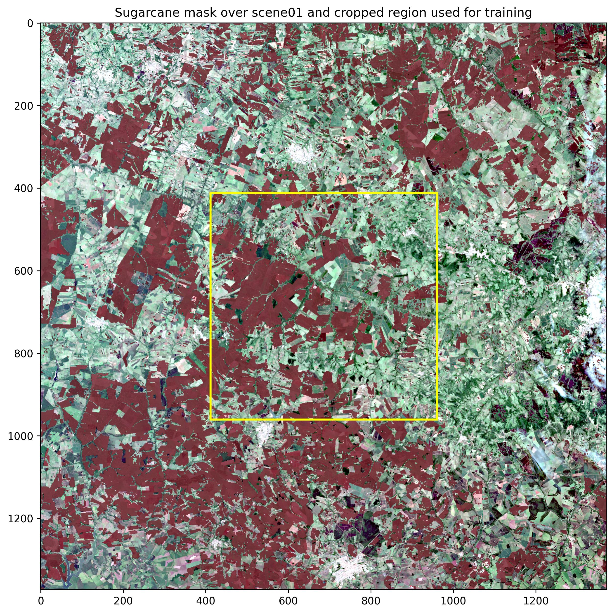
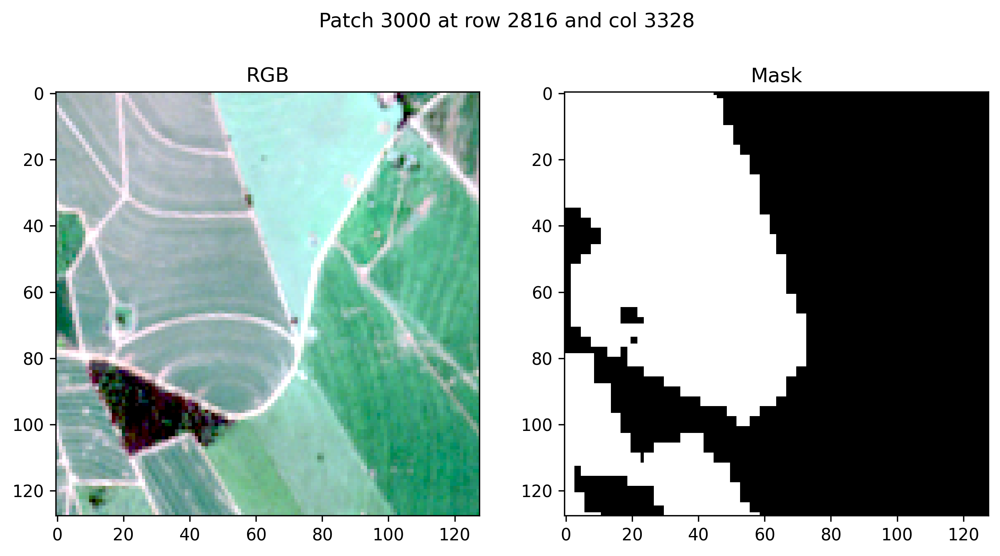
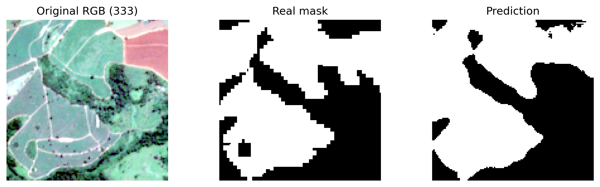
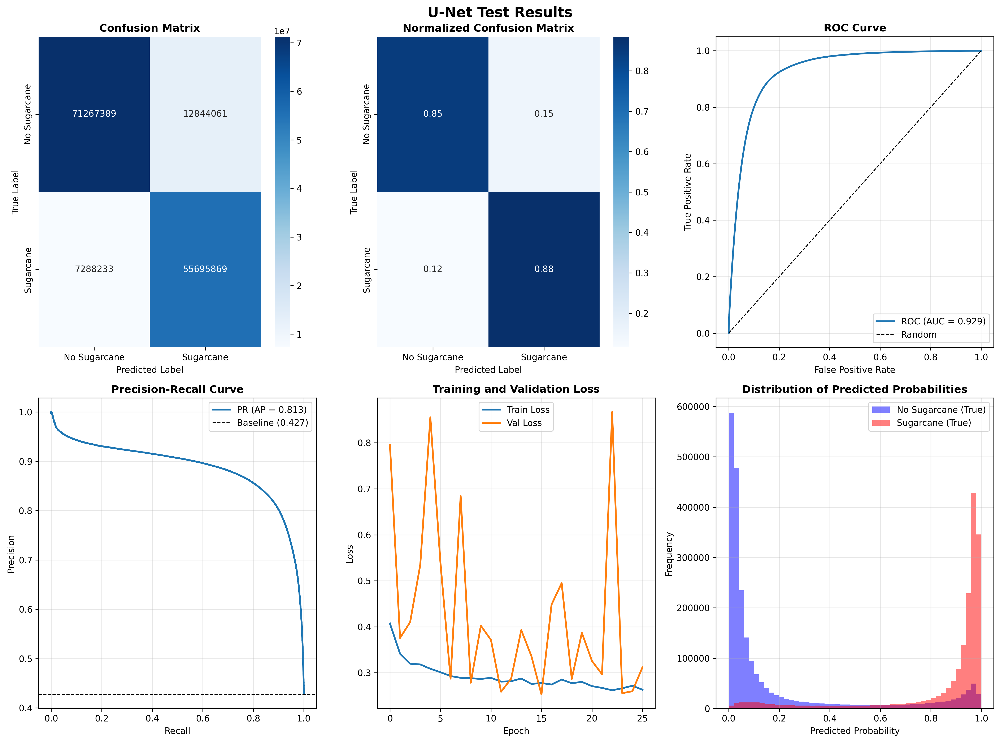

# SpaceSugar

SpaceSugar is a machine-learning project for identifying sugarcane fields in satellite imagery. The current workflow uses a U-Net convolutional neural network trained on image patches. It was developed for the Challenge 1 of the HBR residence with Epic of Sun.

Check how the satellite images and the sugarcane poligons map were obtained [here](https://docs.google.com/document/d/13IcYZTUAA2PNvw97chLme6LqQtXJPMRA42IeirPJtfs/edit?usp=sharing).

## Repository structure

<pre>
├── README.md
├── data/                        # Data for preprocessing and training
│   ├── interim/                 # Merged images to be used in patching
│   ├── processed/               # Processed data to be used in training
│   │   ├── README.md
│   │   ├── sceneXX/             # One scene
│   │   │   ├── images/          # Image patches as numpy arrays for that scene
│   │   │   ├── masks/           # Mask patches as numpy arrays for that scene
│   │   ├── ...
│   │   ├── metadata.json        # General information of the processed data
│   │   └── patch_index.csv      # Index of the patches for organization
│   ├── raw/                     # Raw data
│   │   ├── mask/                # Raw shapefile
│   │   ├── sceneXX/             # Scene XX with raw tif satellite band images
│   │   └── ...
│   └── tfrecords/               # TFRecord datasets for train/val/test
│       ├── counts.json          # General information of the processed data
│       ├── train_000.tfrecord   # Scene XX with TFRecord format
│       └── ...
├── figures/                     # Produced figures as results
│       ├── scenes/
│       ├── unet/
│       ├── fpn/
│       ├── deeplabv3/
│       ├── deeplabv3_plus/
│       ├── pspnet/
│       └── attention_unet/
├── models/                      # Saved model weights, history, hyperparameters, metrics, and benchmarks
│       ├── unet/
│       ├── fpn/
│       ├── deeplabv3/
│       ├── deeplabv3_plus/
│       ├── pspnet/
│       └── attention_unet/
├── preprocessing/               # Preprocessing data
│   ├── preprocessing.ipynb      # Preprocessing data for training
│   └── image_cropping.ipynb     # Jupyter notebook for selecting scene cropping
├── training/                    # Training the models
│   ├── attention_unet.ipynb     # Attention U-Net training notebook
│   ├── deeplabv3.ipynb          # DeepLabV3 training notebook
│   ├── deeplabv3_plus.ipynb     # DeepLabV3+ training notebook
│   ├── fpnt.ipynb               # FPN training notebook
│   ├── pspnet.ipynb             # PSPNet training notebook
│   └── une.ipynb                # U-Net training notebook
└── testing/                     # Testing the models
    ├── metrics.ipynb            # Model metrics evaluation notebook
    └── benchmarks.ipynb         # Model benchmark notebook
</pre>

## What is in this repository

- `preprocessing/`
  Main notebooks for:
  - creating the scenes images
  - loading the raw images and mesh
  - transforming, normalizing, and rasterizing the data
  - slicing it in patches
  - creating the tfrecord files

- `data/processed/`
  Processed image patches and metadata used by the training pipeline.
  This includes files such as `patch_index.csv`.

- `data/tfrecords/`
  TFRecord files used for efficient batched loading during training and evaluation.
  The notebook also expects a `counts.json` file here describing the number of train/validation/test examples.

- `training/`
  Main end-to-end notebooks for:
  - loading libraries and tfrecord files
  - creating train/validation/test datasets
  - building the models
  - training and saving the models

- `testing/`
  Main end-to-end notebooks for:
  - evaluating predictions and generating visualizations
  - benchmarking the trained model

- `models/`
  Output directory for trained model artifacts and training metadata, including, for the U-Net model:
  - `unet_sugarcane.keras`
  - `unet_best_hyperparams.json`
  - `unet_training_history.json`
  - `unet_metrics_data.json`

- `figures/`
  Directory for generated plots such as:
  - loss and accuracy curves
  - confusion matrix and normalized confusion matrix
  - ROC and precision-recall curves
  - sample prediction visualizations

## Data requirements

Before running the notebooks, the repository expects the following folders and files to exist:

- `data/raw/`
  - one folder per scene, e.g. `scene01/`, containing the satellite bands in GeoTIFF format
  - one `mask/` folder with the sugarcane polygons in shapefile format
- `data/interim/`
  - intermediate merged rasters or processed scene composites
- `data/processed/`
  - patch images and masks, plus metadata files such as `patch_index.csv`
- `data/tfrecords/`
  - TFRecord dataset shards for train/validation/test
  - a `counts.json` file with the number of examples in each split

The pipeline assumes:

- input patches are square images of size `128 x 128`
- each input patch contains 4 spectral bands:
  - Blue
  - Green
  - Red
  - NIR
- the notebook expands the input to 7 channels by appending:
  - NDVI
  - NDWI
  - EVI
- labels are binary segmentation masks with shape `(128, 128, 1)`

## Setup and environment

The project is designed for Python 3.10+ and a Jupyter environment.

Recommended setup:

```bash
python -m venv .venv
source .venv/bin/activate
pip install --upgrade pip
pip install tensorflow keras-tuner scikit-learn pandas numpy matplotlib seaborn joblib jupyter
```

If your workflow uses geospatial raster/vector processing during preprocessing, additional packages may be required depending on the notebook implementation, such as:

* rasterio
* geopandas
* shapely
* pyproj
* tqdm

For GPU training, make sure your TensorFlow build matches the CUDA/CUDNN drivers available on the machine. For CPU-only training, the standard TensorFlow install is sufficient.

## Quick start

1. Prepare the raw dataset under `data/raw/` and ensure the shapefile mask is aligned with the satellite scenes.
2. Run the preprocessing notebooks in `preprocessing/` to generate processed patches and TFRecords.
3. Verify that `data/processed/` and `data/tfrecords/` contain the expected metadata and split files.
4. Open `training/training.ipynb` and run the full training workflow.
5. After training, run the evaluation notebook in `testing/` to produce metrics and visualizations.

To launch the notebooks locally:

```bash
jupyter lab
```

## Scenes and patches


The sugarcane mask (red) over scene01 (satellite image) and cropped area used for training.


Example of patch image and mask pair.

## Model outputs

The training pipeline saves the following artifacts to `models/`:

* `unet_sugarcane.keras` - trained model weights and architecture
* `unet_hyperparams.json` - best hyperparameters found during tuning
* `unet_training_history.json` - epoch-by-epoch metrics
* `unet_metrics_data.json` - evaluation metrics (precision, recall, F1, IoU, etc.)

The evaluation pipeline saves figures to `figures/` such as:

* loss/accuracy curves
* confusion matrix
* normalized confusion matrix
* ROC curve
* precision-recall curve
* prediction examples over real scenes

## Main metrics

<!-- DATA_TABLE_START -->
|  | Attention U-Net | DeepLabV3 | DeepLabV3+ | FPN | PSPNet | U-Net |
| --- | --- | --- | --- | --- | --- | --- |
| Precision | 0.80 | 0.81 | 0.77 | 0.82 | 0.79 | 0.81 |
| Recall | 0.87 | 0.82 | 0.87 | 0.87 | 0.86 | 0.88 |
| F1 Score | 0.83 | 0.81 | 0.82 | 0.84 | 0.82 | 0.85 |
| ROC AUC | 0.92 | 0.91 | 0.91 | 0.93 | 0.91 | 0.93 |
| IoU | 0.72 | 0.68 | 0.69 | 0.73 | 0.70 | 0.73 |
| Number of parameters (10^6) | 7.90 | 25.45 | 26.74 | 6.10 | 23.94 | 7.77 |
| Parameter size (MB) | 30.14 | 97.08 | 102.02 | 23.26 | 91.32 | 29.64 |
| Mean latency (ms) | 71.86 | 132.08 | 146.97 | 59.07 | 131.77 | 51.22 |
| Median latency (ms) | 70.56 | 130.22 | 145.03 | 57.49 | 130.05 | 50.00 |
| 95th percentile latency (ms) | 77.90 | 145.57 | 158.73 | 68.47 | 145.85 | 57.89 |
| Latency standard deviation (ms) | 4.33 | 6.55 | 5.75 | 5.75 | 7.33 | 3.08 |
<!-- DATA_TABLE_END -->

### Best model


Example of image and mask pair and the model result.


Some metrics of the trained test U-Net.

## Common conventions and caveats

* The repository is notebook-centric; the main workflow is run from Jupyter notebooks rather than a packaged CLI.
* The dataset split is assumed to be train/validation/test, and `counts.json` should reflect the number of examples in each split.
* The current implementation focuses on binary segmentation of sugarcane vs. non-sugarcane, not multi-class land-cover classification.
* If the data layout or file names change, the notebooks may need to be updated to match the new structure.
* The project uses patches of size `128 x 128`; full-scene inference typically requires stitching or sliding-window prediction outside the notebook workflow.

## Dependencies

The project relies on the following Python packages:

* TensorFlow / Keras
* Keras Tuner
* scikit-learn
* pandas
* numpy
* matplotlib
* seaborn
* joblib

## Running the training pipeline

1. Install the dependencies:
```bash
pip install tensorflow keras-tuner scikit-learn pandas numpy matplotlib seaborn joblib
```
2. Open and run `training/training.ipynb` if you want to train from scratch.
3. Open and run `testing/test.ipynb` to check the results and metrics.

### Outputs

After training, the project generates:

* a saved Keras model in `models/`
* training history in JSON format

The test notebook also generates:

* metrics in `models/`
* evaluation figures in `figures/`

## Notes

* The repository is currently centered around the notebook-based training workflow.
* If the dataset layout or file structure changes, the notebook and associated paths may need to be updated accordingly.
* The current implementation is focused on binary segmentation for sugarcane presence/absence rather than multi-class land-cover classification.
