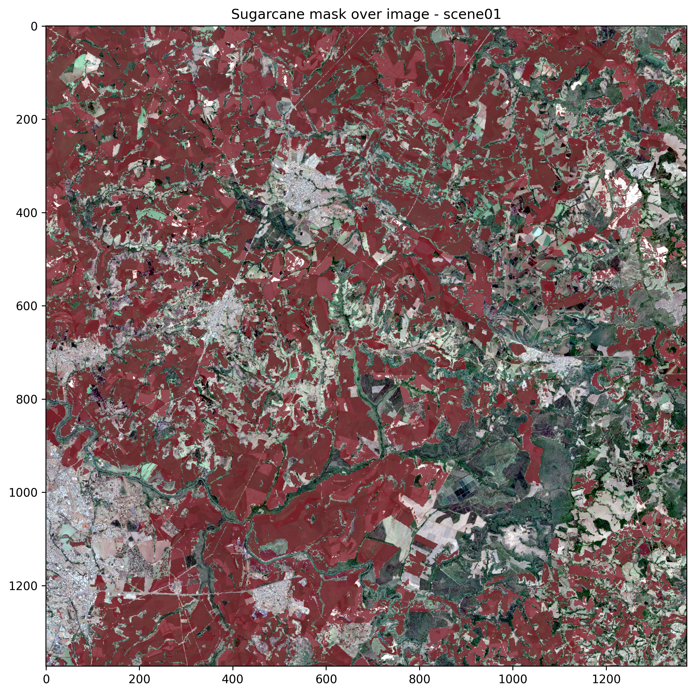
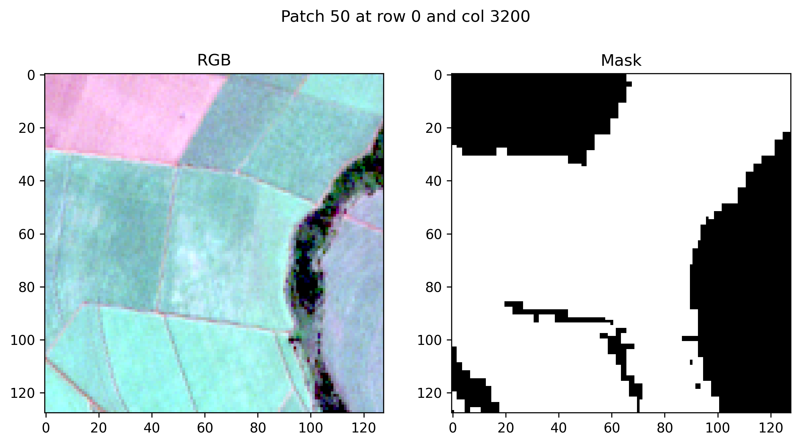
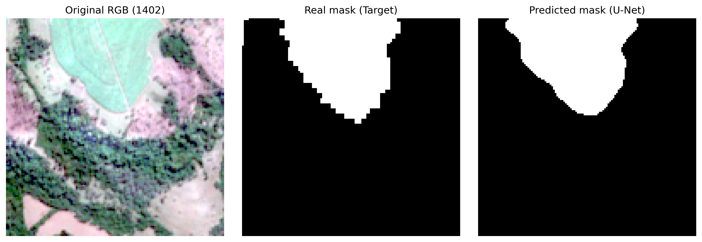

# SpaceSugar

Code for the Challenge 1 of the HBR residence with Epic of Sun.

## Overview

Check how the satellite images and the sugarcane poligons map were obtained [here](https://docs.google.com/document/d/13IcYZTUAA2PNvw97chLme6LqQtXJPMRA42IeirPJtfs/edit?usp=sharing).

## Repository structure

<pre>
├── README.md
├── data                     # Data for preprocessing and training
│   ├── interim              # Merged images to be used in patching
│   ├── processed            # Processed data to be used in training
│   │   ├── README.md
│   │   ├── sceneXX          # One scene
│   │   │   ├── images       # Image patches as numpy arrays for that scene
│   │   │   ├── masks        # Mask patches as numpy arrays for that scene
│   │   │   ...
│   │   ├── metadata.json    # General information of the processed data
│   │   └── patch_index.csv  # Index of the patches for organization
│   └── raw                  # Raw data
│       ├── mask             # Raw shapefile
│       ├── sceneXX          # Scene XX with raw tif satellite band images
│       └── ...
├── figures                  # Produced figures as results
├── models                   # The saved models after training
├── preprocessing_test.ipynb # Jupyter notebook for test preprocessing one scene
├── preprocessing.ipynb      # Jupyter notebook for preprocessing the data
└── training.ipynb           # Jupyter notebook for training the model
</pre>

## Figures

The sugarcane mask over satellite test image

Example of patch image and mask pair.

Example of image and mask pair and the model result.

Some metrics of the trained test UNet.
